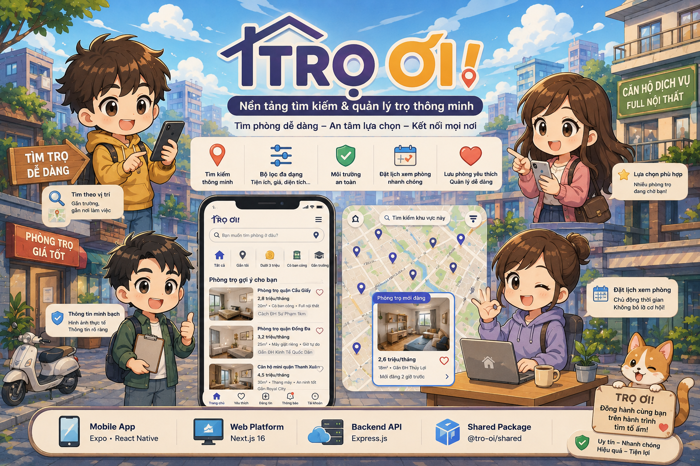

<div align="center">
  

# 🏠 TRỌ ƠI! - PLATFORM TÌM KIẾM & QUẢN LÝ TRỌ THÔNG MINH

[](https://yarnpkg.com/)
[](https://expo.dev/)
[](https://nextjs.org/)
[](https://expressjs.com/)
[](https://www.typescriptlang.org/)

  <p align="center">
    <b>Nền tảng kết nối người thuê trọ và chủ trọ toàn diện với trải nghiệm UI/UX chuẩn Messenger, mượt mà và hiện đại.</b>
  </p>
</div>

---

## 🌟 Giới Thiệu (Overview)

**Trọ Ơi!** là giải pháp công nghệ hiện đại giúp tối ưu hóa việc tìm kiếm, đăng tin và quản lý phòng trọ/căn hộ dịch vụ. Dự án được thiết kế theo kiến trúc **Monorepo** linh hoạt, chia sẻ mã nguồn giữa ứng dụng **Mobile (Expo/React Native)**, **Web (Next.js 16)** và **Backend API (Express.js)**.

---

## ✨ Tính Năng Nổi Bật (Key Features)

### 📱Ứng Dụng Mobile (React Native / Expo)

- **💬 Trải Nghiệm Chat Chuẩn Messenger:**
  - Swipe-to-reply, ghim tin nhắn, khung composer thu gọn linh hoạt với bàn phím.
  - Tối ưu hóa hiệu năng 60fps với `react-native-reanimated` & Shared Element Transitions.
  - Hiển thị trạng thái đang nhập (typing indicators) & xem trước tệp đa phương tiện.
- **📸 Story Feature:** Đăng tin và xem khoảnh khắc (Story) tương tự Messenger/Instagram.
- **🔍 Tìm Kiếm Thông Minh:** Tìm phòng theo vị trí, mức giá, tiện ích đi kèm với bộ lọc trực quan.
- **👤 Quản Lý Hồ Sơ & Đặt Lịch:** Đặt lịch xem phòng và lưu danh sách phòng yêu thích.

### 🌐 Nền Tảng Web (Next.js 16)

- Dashboard cho chủ trọ quản lý danh sách phòng, hợp đồng và khách thuê.
- Giao diện tìm kiếm phòng tối ưu SEO, hỗ trợ Responsive & Dark/Light mode với Tailwind CSS.

---

## 🏗️ Kiến Trúc Hệ Thống (Architecture)

<div align="center">
  
</div>

```
tro-oi/
├── apps/
│   ├── api/        # Node.js & Express.js RESTful API
│   ├── mobile/     # Expo (React Native) iOS & Android App
│   └── web/        # Next.js 16 Web Application
├── packages/
│   └── shared/     # Thư viện dùng chung (Types, Utilities, Helpers)
├── assets/
│   └── images/     # Tài nguyên hình ảnh dự án
├── package.json    # Yarn Workspaces Root Config
└── README.md
```

---

## 🛠️ Công Nghệ Sử Dụng (Tech Stack)

| Hạng mục              | Công nghệ                                             |
| --------------------- | ----------------------------------------------------- |
| **Core Architecture** | Yarn Workspaces (Monorepo), TypeScript                |
| **Mobile App**        | React Native, Expo SDK 54, Expo Router, Reanimated v4 |
| **Web Platform**      | Next.js 16, React 19, Tailwind CSS v4                 |
| **Backend API**       | Node.js, Express 5, TSX                               |
| **Shared Package**    | `@tro-oi/shared`                                      |

---

## 🚀 Hướng Dẫn Cài Đặt & Chạy Dự Án (Getting Started)

### 📋 Yêu Cầu Tiên Quyết

- **Node.js**: `>= 18.x`
- **Yarn**: `1.22.x` (Yarn Classic / Workspaces)

### 📥 1. Clone Repository & Cài Đặt Dependencies

```bash
git clone https://github.com/kinghatrung/tro_oi_platform.git
cd tro-oi
yarn install
```

### ⚡ 2. Chạy Các Ứng Dụng (Development Mode)

Chạy đồng thời hoặc chọn riêng lẻ từng dịch vụ:

- **Chạy Web App (Next.js):**

  ```bash
  yarn dev:web
  ```

  _(Truy cập `http://localhost:3000`)_

- **Chạy Backend API (Express):**

  ```bash
  yarn dev:api
  ```

  _(API chạy tại `http://localhost:5000` hoặc cổng được cấu hình)_

- **Chạy Mobile App (Expo):**
  ```bash
  yarn dev:mobile
  ```
  _(Quét mã QR bằng ứng dụng Expo Go trên Android/iOS)_

---

## 📄 Giấy Phép (License)

Dự án được phân phối dưới giấy phép **MIT License**.

---

